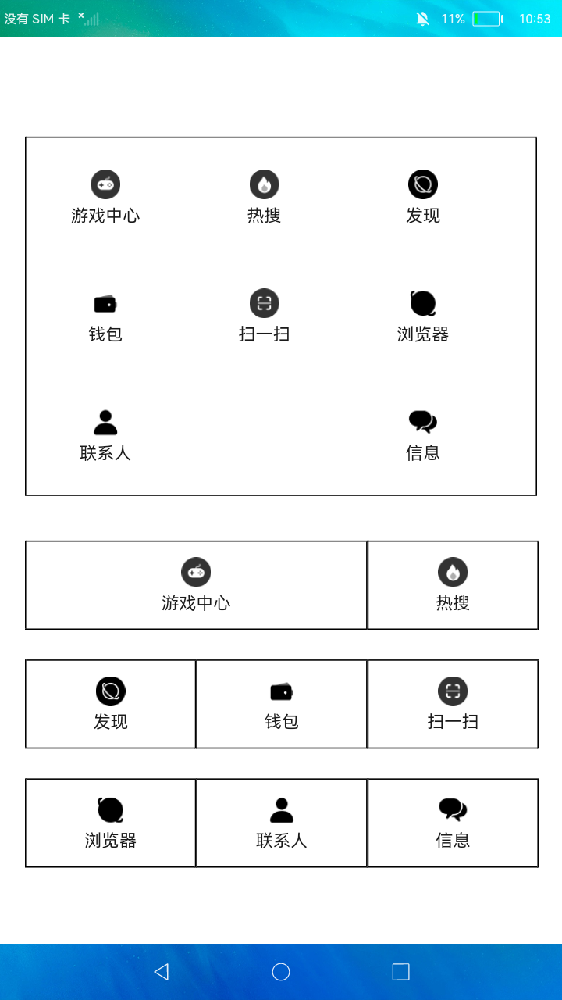

# 栅格布局

### 简介

本示例通过栅格系统进行元素布局，主要由<grid-container\>、<grid-row\>、<grid-col\>标签来实现。

实现效果如下：

### 相关概念

-  Grid：网格容器，由“行”和“列”分割的单元格所组成，通过指定“项目”所在的单元格做出各种各样的布局。

### 相关权限

不涉及

### 使用说明

示例显示了2组应用，上下两组应用均采用栅格布局，来展示不同的效果，点击**应用图标**、**文字**分别弹出对应的通知。

### 约束与限制

1.本示例仅支持在标准系统上运行。

2.本示例需要使用DevEco Studio 3.0 Beta3 (Build Version: 3.0.0.901, built on May 30, 2022)才可编译运行。
