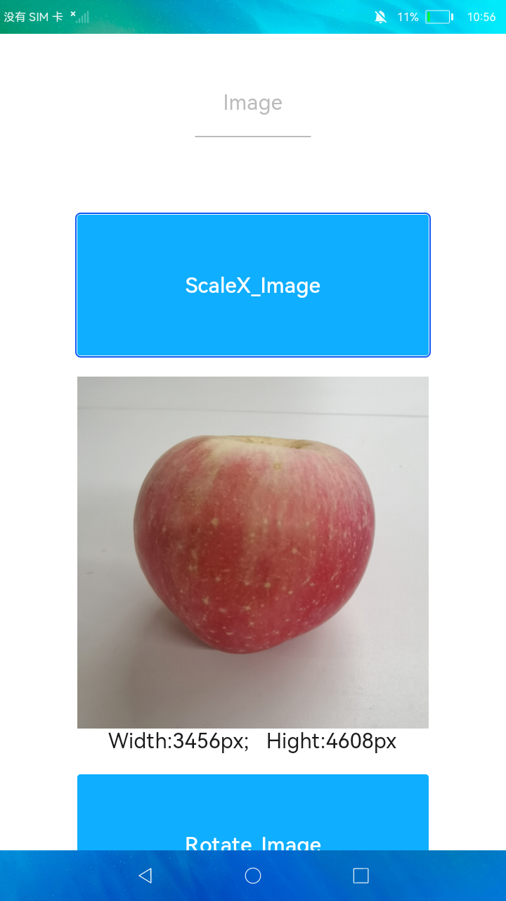

# 基本动画

### 简介

本示例演示了 JS FA 应用中，图片组件常见的几种动画，如：缩放，旋转，平移，渐变等。效果图如下：

### 相关概念

- [图形变换](https://gitee.com/openharmony/docs/blob/master/zh-cn/application-dev/reference/arkui-ts/ts-universal-attributes-transformation.md)：图形变换。

### 相关权限

不涉及

### 使用说明

从上往下依次点击**按钮**，图片会实现缩放、旋转、翻转的动画效果。

### 约束与限制

1.本示例仅支持在大型系统上运行。

2.本示例需要使用DevEco Studio 3.0 Beta3 (Build Version: 3.0.0.901, built on May 30, 2022)才可编译运行。