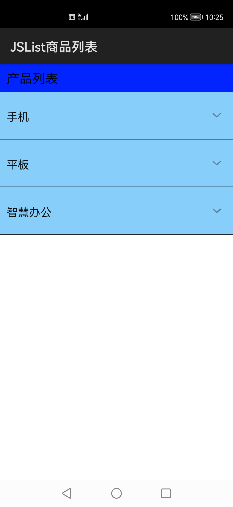

# 商品列表

### **简介**

本示例展示了list控件在商品分类列表中的应用，在listGroup里采用两个list-item分别展示了Group收缩和Group展开的两种列表形态，点击后会弹出相应的list列表。实现效果如下：

#相关概念

List组件包含一系列相同宽度的列表项。适合连续、多行呈现同类数据，例如图片和文本。

### 相关权限

不涉及

### **使用说明**

1.本应用以收缩后的列表页面作为初始界面，此界面采用<list-item\>作为<list\>子组件展示了手机、平板、智慧办公三个品类，实现了点击其中一种商品品类，展示出对应品类的商品列表的功能。再次点击某个展开后的列表，将收缩展开列表。

2.可通过增删改zh-cn.json文件中各类栏目商品的数据，查看购物界面的变化。

### **约束与限制**

1.本示例支持标准系统上运行。

2.本示例需要使用DevEco Studio 3.0 Beta3 (Build Version: 3.0.0.901, built on May 30, 2022)才可编译运行。
