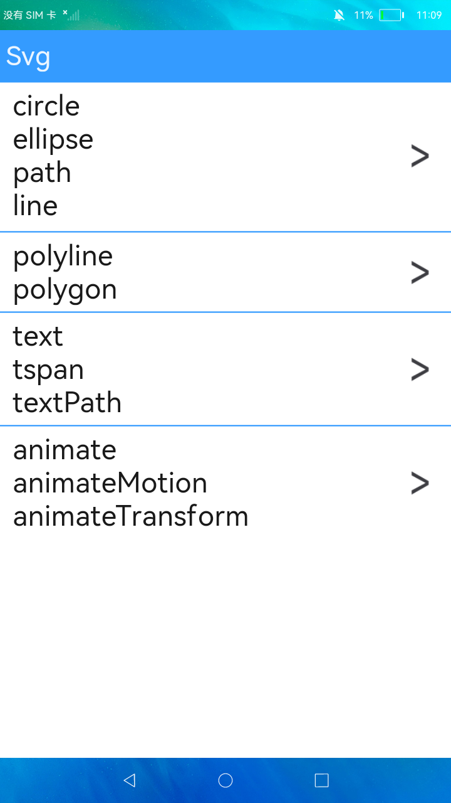
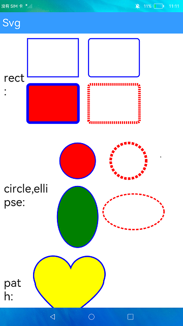

# 可缩放矢量图形

### 简介

本示例展示了JS中<svg\>组件及其子组件的使用，包括<svg\>、<rect\>、<circle\>、<ellipse\>、<path\>、<line\>、<polygon\>、<polyline\>、<text\>、<animate\>、<animateTransform\>。实现效果如下：

 

### 相关概念

- svg：基础容器，主要作为svg的根节点使用，也可以在svg中嵌套使用，支持设置属性动画、路径动画、位移动画等。

### 相关权限

不涉及

### 使用说明

1.首页中<svg\>的子组件很多，本示例中，在首页显示一个列表，将svg的子组件分为四个列表项展示，点击进入对应的界面可以查看各个子组件的显示效果。

### 约束与限制

1.本示例支持标准系统上运行。

2.本示例需要使用DevEco Studio 3.0 Beta3 (Build Version: 3.0.0.901, built on May 30, 2022)才可编译运行。