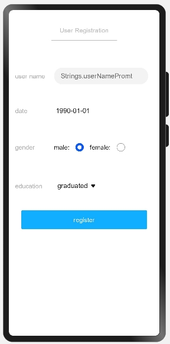

# 用户注册

### 简介

本示例通过用户注册案例来展示 JS FA 应用基本控件的使用，包括文本输入框，日期选择控件，单选按钮，下拉菜单和普通按钮等。实现效果如下：
 

### 相关概念

页面路由：页面路由需要在页面渲染完成之后才能调用，在onInit和onReady生命周期中页面还处于渲染阶段，禁止调用页面路由方法。
弹窗：文本提示框。

### 相关权限

不涉及

### 使用说明

按要求输入姓名，选择出生日期、性别、学历，点击**register**按钮，提示success注册成功。

### 约束与限制

1.本示例仅支持在标准系统上运行。

2.本示例需要使用DevEco Studio 3.0 Beta3 (Build Version: 3.0.0.901, built on May 30, 2022)才可编译运行。