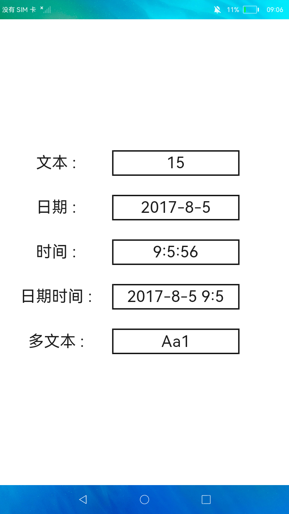

# 滑动选择器

### 简介

本示例展示<picker>组件的使用方法，实现了普通选择器，日期选择器，时间选择器，时间日期选择器，多列文本选择器。

实现效果如下：

### 相关概念

-  TextPicker：文本类滑动选择器组件。

-  TimePicker：选择时间的滑动选择器组件。

-  DatePicker：选择日期的滑动选择器组件。

### 相关权限

不涉及

### 使用说明

点击各个显示框中的文本内容，弹出对应选择器，在选择器中选择任意值，点击确定后文本显示框中会显示所选择的值。

### 约束与限制

1.本示例仅支持标准系统上运行。

2.本示例需要使用DevEco Studio 3.0 Beta3 (Build Version: 3.0.0.901, built on May 30, 2022)才可编译运行。
