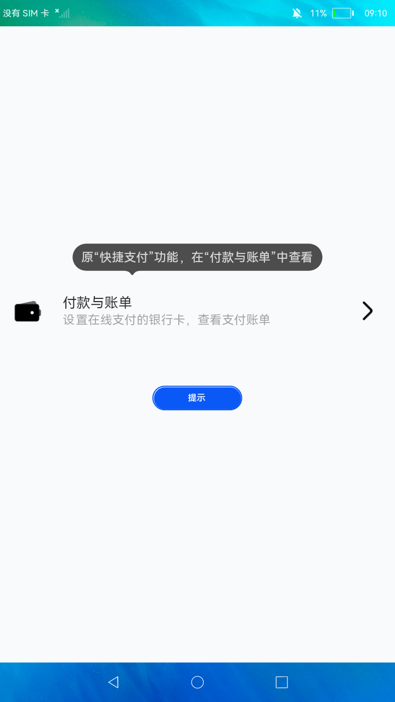

# 气泡

### 简介

本示例展示了JS气泡提示，在点击绑定的控件后会弹出相应的气泡来引导用户进行操作。开发者可自行定义该控件的位置、样式、响应事件等属性信息。

实现效果如下：

### 相关概念

-  Popup：气泡控制组件。

### 相关权限

不涉及

### 使用说明

进入应用主界面后，点击**提示**按钮或者文本框，JS气泡提示会出现，点击**JS气泡提示**后，气泡提示会消失。

### 约束与限制

1.本示例仅支持在标准系统上运行。

2.本示例需要使用DevEco Studio 3.0 Beta3 (Build Version: 3.0.0.901, built on May 30, 2022)才可编译运行。