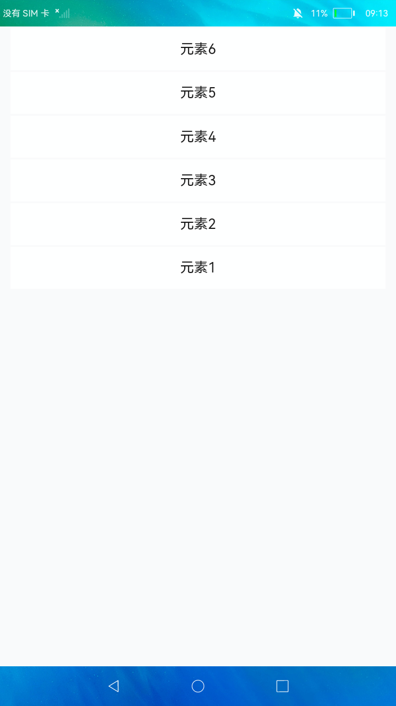

# 下拉刷新容器

### 简介

本示例展示了JS UI框架中refresh组件的使用方法，refresh组件可以刷新子组件中的内容，并且可以自定义触发条件。

实现效果如下：

### 相关概念

-  Refresh：下拉刷新容器。

### 相关权限

不涉及

### 使用说明

进入应用后，下拉列表出现刷新图标，刷新结束后，新增两个ltem。

### 约束与限制

1.本示例仅支持在标准系统上运行。

2.本示例需要使用DevEco Studio 3.0 Beta3 (Build Version: 3.0.0.901, built on May 30, 2022)才可编译运行。

