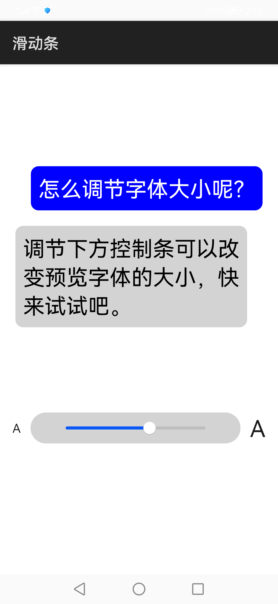

# 滑动条

### 简介

<slider\>组件常用来作为声音、亮度、字体等的设置。本示例展示了使用<slider\>组件来调整界面字体大小。

实现效果如下：

### 相关概念

-  Slider：滑动条组件，用来快速调节设置值，如音量、亮度等。

### 相关权限

不涉及

### 使用方法

 此应用中滑动条共分六级，分别对应字体的六个大小。通过滑动滑动条，可以调整界面字体大小。

### 约束与限制

1.本示例仅支持标准系统运行。

2.本示例需要使用DevEco Studio 3.0 Beta3 (Build Version: 3.0.0.901, built on May 30, 2022)才可编译运行。
