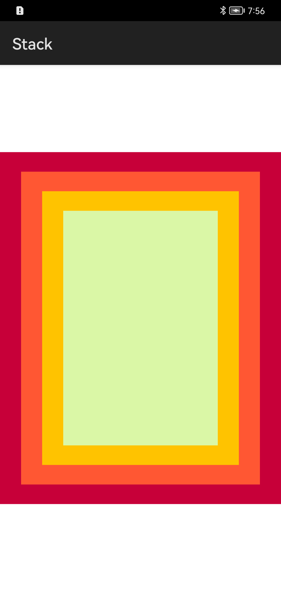

# 堆叠容器

### 简介

堆叠容器stack，子组件按照顺序依次入栈，后一个子组件覆盖前一个子组件。实现效果如下：

### 相关概念

-  Stack：堆叠容器，子组件按照顺序依次入栈，后一个子组件覆盖前一个子组件。

### 相关权限

不涉及

### 使用说明

本示例页面显示色块堆叠，从下往上颜色依次为红色、橙色、黄色、绿色。

### 约束与限制

1.本示例仅支持在标准系统上运行。

2.本示例需要使用DevEco Studio 3.0 Beta3 (Build Version: 3.0.0.901, built on May 30, 2022)才可编译运行。

