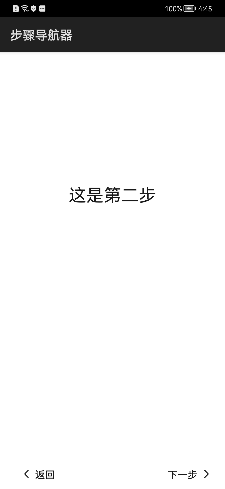

# 步骤导航器

### 简介

本示例展示了JS UI 框架中stepper组件和 stepper-item子组件的使用方法。当完成一个任务需要多个步骤时，可以使用步骤导航器展示当前进展。

实现效果如下：

### 相关概念

-  Stepper：步骤导航器。

-  StepperItem：步骤导航器元素。

### 相关权限

不涉及

### 使用说明

1.依据导航提示执行下一步，步骤执行结束后进入主页。

2.进入主页后，点击**重置**重新回到步骤一。

3.在第三步中可选择“同意跳过后续步骤”，再点击**跳过**直接进入主页。

### 约束与限制

1.本示例仅支持标准系统上运行。

2.本示例需要使用DevEco Studio 3.0 Beta3 (Build Version: 3.0.0.901, built on May 30, 2022)才可编译运行。

