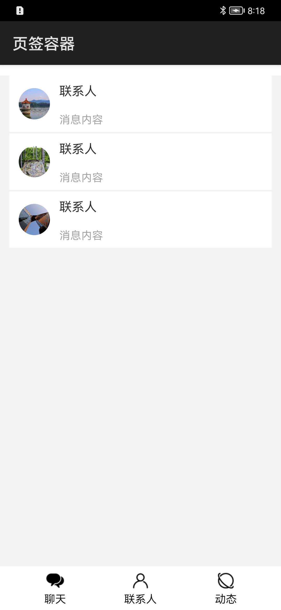

# 页签容器

### 简介

本示例展示了tabs页签容器的使用，可通过子标签tab-bar来设置标签，子标签tab-content来设置内容。标签数目与内容页面数目相同就会依照顺序绑定。

实现效果如下：

### 相关概念

-  Tabs：一种可以通过页签进行内容视图切换的容器组件，每个页签对应一个内容视图。

-  TabContent：仅在Tabs中使用，对应一个切换页签的内容视图。

### 相关权限

不涉及

### 使用说明

进入应用主界面后可通过点击应用底部的页签进行页面切换，也可左右滑动切换页面。

### 约束与限制

1.该示例仅在标准系统上运行。

2.本示例需要使用DevEco Studio 3.0 Beta3 (Build Version: 3.0.0.901, built on May 30, 2022)才可编译运行。

