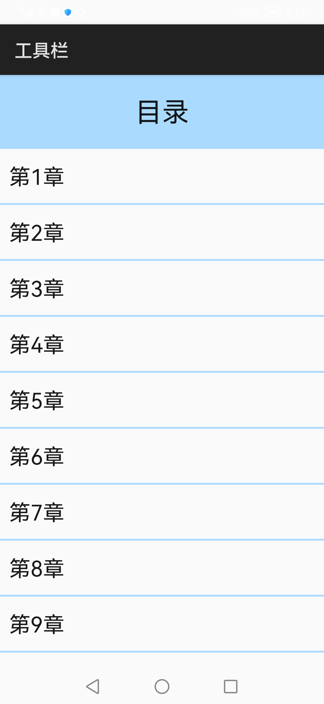

# 工具栏

### 简介

工具栏<toolbar\>放在界面底部，可展示针对当前界面的各种操作，子组件<toolbar-item\>

表示工具栏上的一个操作选项，必须为其设置图片与文字。本示例使用工具栏实现了对小说阅读界面的模拟。

实现效果如下：

### 相关概念

-  Navigation：Navigation组件一般作为Page页面的根容器，通过属性设置来展示页面的标题、工具栏、菜单。

### 相关权限

不涉及

### 使用说明

本示例主界面为列表目录，点击**列表条目**，跳转到对应章节内容，点击**内容**可呼出工具栏，可通过工具栏中的操作选项来更改页面属性或章节跳转。

### 约束与限制

1.本示例仅支持在标准系统上使用。

2.本示例需要使用DevEco Studio 3.0 Beta3 (Build Version: 3.0.0.901, built on May 30, 2022)才可编译运行。
