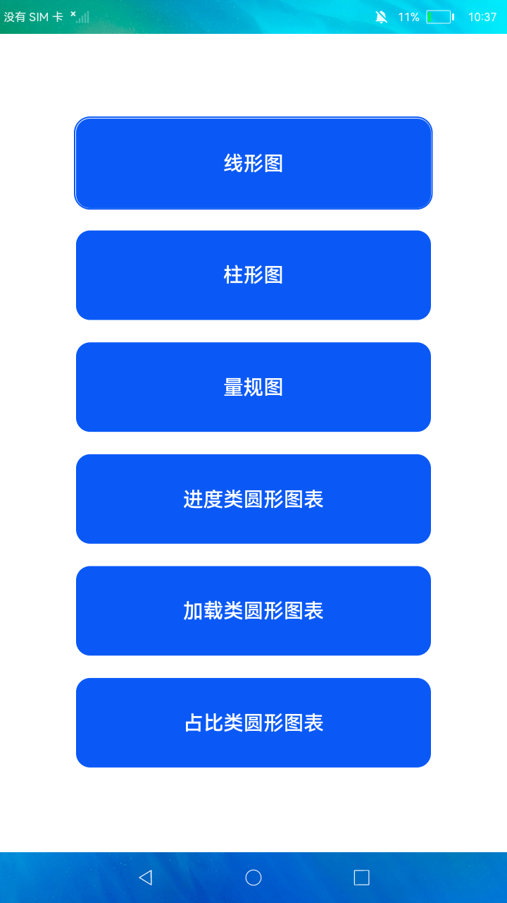

# 图表组件

### 简介

本示例主要展示了图表组件chart的使用，该组件支持绘制柱形图、线形图、量规图、加载图、进度图和占比图这6种类型的图表。

实现效果如下：

### 相关概念

-  图表组件：用于呈现线形图、柱状图、量规图界面。

### 相关权限

不涉及

### 使用说明

本示例主界面为6个按钮，点击**按钮**查看对应类别的图表。

### 约束与限制

1.本示例仅支持在标准系统上运行。

2.本示例需要使用DevEco Studio 3.0 Beta3 (Build Version: 3.0.0.901, built on May 30, 2022)才可编译运行。

