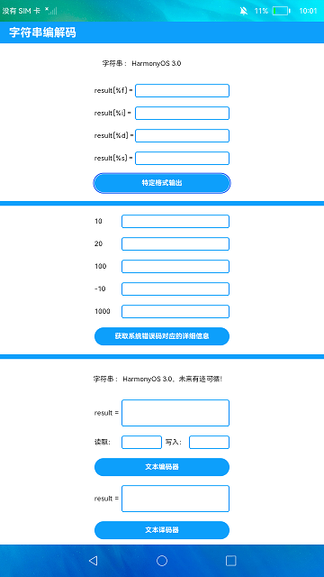

# 字符串编解码

### 简介

本示例对字符串进行了特定格式的输出，对错误码的内容进行了文本输出，对字符串的编码和解码做了演示结果。实际效果如下：

#相关概念

1.特定格式输出:可以对字符串进行特定格式的输出。

2.错误码解析：可以根据输入的错误码获取出相应的错误信息。

3.文本编解码：可以对字符串进行编码和解码的操作。

### 相关权限

不涉及

### 使用说明

1.点击**特定格式输出**，文本框会对该字符串进行不同格式的结果输出，例如整数、浮点数、字符串等格式。

2.点击**获取系统对应的详细信息**按钮，每行文本框输出左边的错误码所表示的具体文本意思。

3.点击**文本编辑器**，会对上面字符串编码后输出对应文本，并输出数据读取与写入的相关信息。

4.点击**文本译码器**，会对上面编码的文本内容进行译码，输出结果为上述编码前的字符串。

### 约束与限制

1.本示例仅支持在标准系统上运行。

2.本示例需要使用DevEco Studio 3.0 Beta3 (Build Version: 3.0.0.901, built on May 30, 2022)才可编译运行。