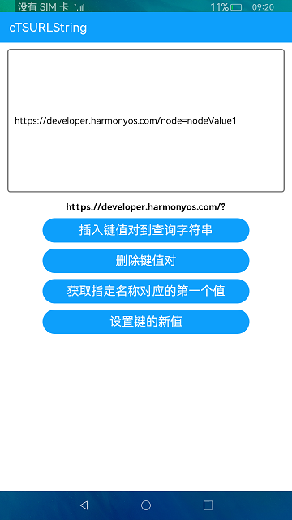

# URL字符串解析

### 简介

本示例对URL字符串的查找参数进行了增删改查的一系列操作，使得读者对URL的结构用途更加明了。实际效果如下：

#相关概念

1.键值插入：可以将新的键值对插入到查询字符串。

2.键值删除：删除指定名称的键值对。

3.键值判断：判断一个指定的键名对应的值是否存在。

4.键值获取：获取指定名称对应的第一个值。

5.设置新的键值：将与name关联的URLSearchParams对象中的值设置为value。

### 相关权限

不涉及

### 使用说明

1.点击**插入键值对到查询字符串**按钮，会将左面文本框的参数插入到查找参数后面。

2.点击**删除键值对**按钮，会将指定名称的键值对删除。

3.点击**获取指定名称对应的第一个值**按钮，将查找参数中该参数名对应的第一个参数值，并显示出来。

4.点击**设置键的新值**按钮，将与名称相关联的键值对全部删除，并赋予该键名一个新值。

### 约束与限制

1.本示例仅支持在标准系统上运行。

2.本示例需要使用DevEco Studio 3.0 Beta3 (Build Version: 3.0.0.901, built on May 30, 2022)才可编译运行。