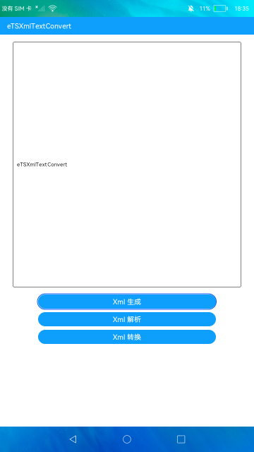

# xml文本转换

### 简介

本示例通过XmlSerializer生成xml文本，通过XmlPullParser解析xml文本，通过ConvertXML将xml文本转换为JavaScript对象。实现效果如下：

### 相关概念

xml解析与生成、xml转换JavaScript。

### 相关权限

不涉及

### 使用说明

1.点击**Xml 生成**按钮，会构建xml文本，并在按钮上方的文本框显示xml文本内容。

2.点击**Xml 解析**按钮，会解析已经预置的xml文本，并在文本框显示解析信息。

3.点击**Xml 转换**按钮，会将预置的xml文本转换为JavaScript对象，并在文本框显示。

### 约束与限制

1.本示例仅支持在标准系统上运行。

2.本示例需要使用DevEco Studio 3.0 Beta3 (Build Version: 3.0.0.901, built on May 30, 2022)才可编译运行。