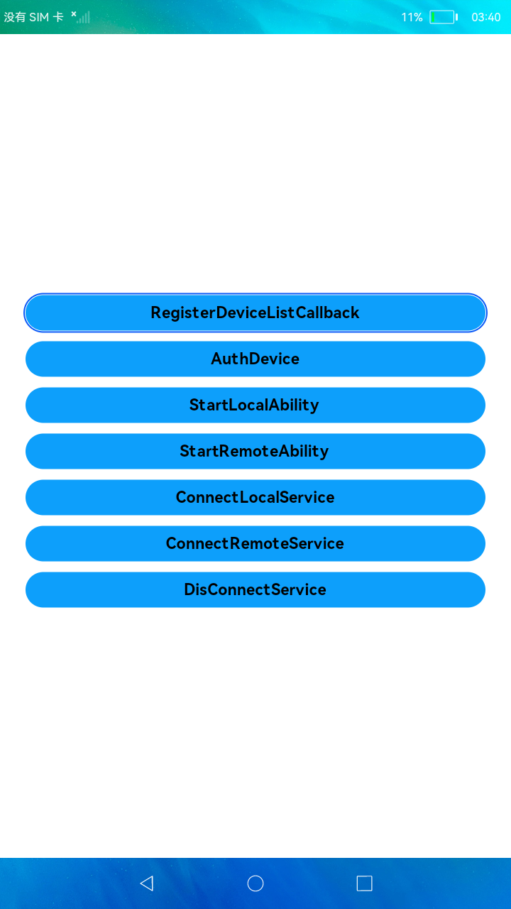

# 分布式Demo

### 简介

本示例展示了在eTS中如何构建分布式Ability和Service,包含:

1.通过分布式硬件提供的接口，获取设备。

2.远程拉起对端Ability。

3.远程绑定对端Service。

实现效果如下：

### 相关概念

-  分布式数据服务：分布式数据服务（Distributed Data Service，DDS） 为应用程序提供不同设备间数据库的分布式协同能力。通过调用分布式数据接口，应用程序将数据保存到分布式数据库中。通过结合帐号、应用和数据库三元组，分布式数据服务对属于不同应用的数据进行隔离，保证不同应用之间的数据不能通过分布式数据服务互相访问。在通过可信认证的设备间，分布式数据服务支持应用数据相互同步，为用户提供在多种终端设备上最终一致的数据访问体验。

### 相关权限

分布式服务：ohos.permission.DISTRIBUTED_DATASYNC

### 使用说明

1.两台设备组网

2.对弹出的分布式权限弹框进行授权

3.在一台设备界面中点击RegisterDeviceListCallback注册设备,成功后点击AuthDevice认证设备,在另一台设备输入对应的PIN。

4.连接成功后可调用本地Ability、对端Ability、本地Service、远端Service。

5.操作对端设备，当前设备界面也会保持和对端设备界面显示一致。

### 约束与限制

1.本示例仅支持标准系统上运行，支持API version 8及以上版本。

2.本示例需要使用DevEco Studio 3.0 Beta3 (Build Version: 3.0.0.901, built on May 30, 2022)才可编译运行。