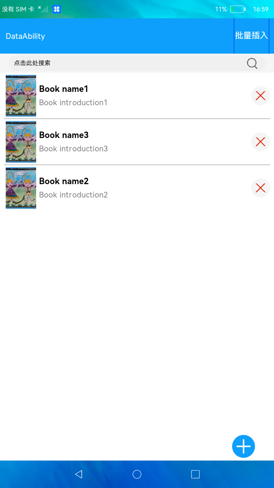

# DataAbility的创建与使用

### 简介

本示例展示了在eTS中DataAbiltiy的创建与访问，其中DataAbiltiy中的增删改查接口使用rdb实现，使用DataAbilityHelper进行访问。实现效果如下：

### 相关概念

-  DataAbility：基于Data模板的Ability（以下简称“Data”），有助于应用管理其自身和其他应用存储数据的访问，并提供与其他应用共享数据的方法。Data既可用于同设备不同应用的数据共享，也支持跨设备不同应用的数据共享。

### 相关权限

不涉及

### 使用说明

1.在首页点击右上角的**批量插入**按钮或者右下角的 **+** 按钮可以通过DataAbilityHelper向DataAbiltiy中插入数据。

2.在首页中添加数据后，点击书籍列表中的**X**按钮可以删除该条数据。

3.点击书籍列表中的一条数据，可以进入编辑界面编辑该条数据，点击**✓**可以更新数据并返回首页。

4.在首页点击列表顶部的搜索框进入搜索界面，在搜索框中输入字符串，可以搜索书名和简介包含所输入字符串的书籍，并显示在搜索框下的列表中。

### 约束与限制

1.本示例仅支持标准系统上运行。

2.本示例需要使用DevEco Studio 3.0 Beta3 (Build Version: 3.0.0.901, built on May 30, 2022)才可编译运行。