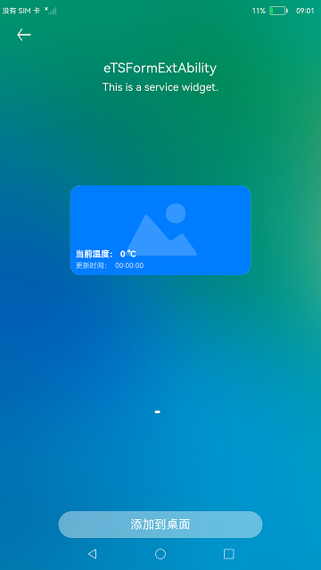

# FA模型卡片

### 简介

本示例展示了FA模型卡片提供方的创建与使用。

### 使用说明

1.部分设备的桌面不支持卡片，可以通过自己的开发卡片使用方，进行卡片的创建、更新和删除等操作。具体参考：[卡片使用方说明](../FormLauncher/README_zh.md)。

2.卡片的样式如下图所示。当卡片更新时，卡片上的温度和时间会产生变化。

### 约束与限制

1.本示例仅支持标准系统上运行。

2.本示例需要使用3.0.0.901及以上的DevEco Studio版本才可编译运行。
