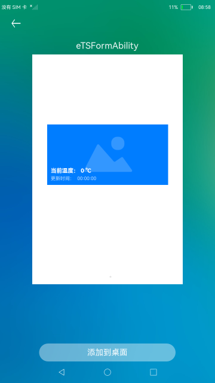
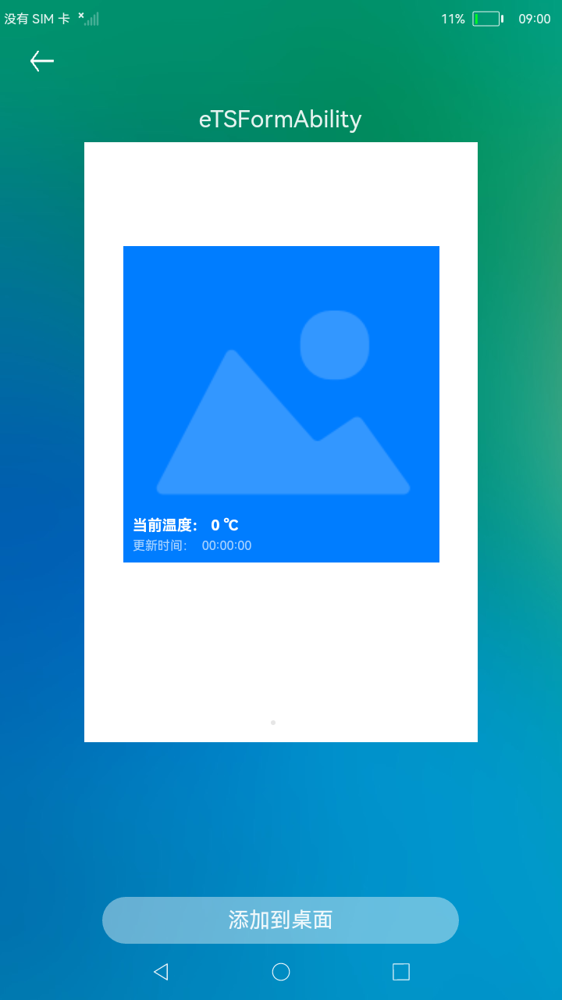

# FA模型卡片

### 简介

本示例展示了FA模型卡片提供方的创建与使用。

### 相关概念

卡片提供方：提供卡片显示内容原子化服务，控制卡片的显示内容、控件布局以及控件点击事件。

卡片管理服务：用于管理系统中所添加卡片的常驻代理服务，包括卡片对象的管理与使用，以及卡片周期性刷新等。

### 相关权限

不涉及。

### 使用说明

1.部分设备的桌面不支持卡片，可以通过自己的开发卡片使用方，进行卡片的创建、更新和删除等操作。

2.卡片的样式如下图所示。当卡片更新时，卡片上的温度和时间会产生变化。

### 约束与限制

1.本示例仅支持标准系统上运行。

2.本示例需要使用DevEco Studio 3.0 Beta3 (Build Version: 3.0.0.901, built on May 30, 2022)才可编译运行。
