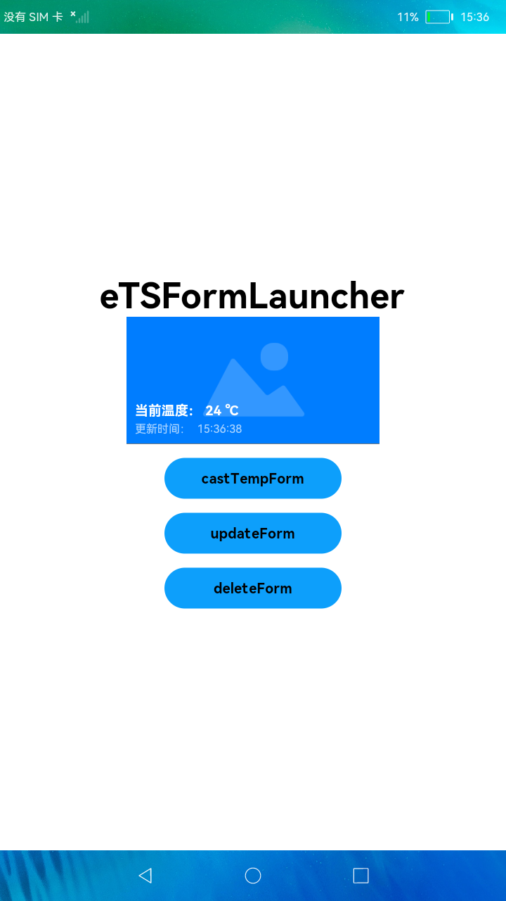

# 卡片使用方

### 简介

本示例展示了FA模型卡片使用方的创建与使用，包括创建与展示卡片、转换卡片、更新卡片、删除卡片等功能。

### 相关概念

卡片使用方：显示卡片内容的宿主应用，控制卡片在宿主中展示的位置。

卡片管理服务：用于管理系统中所添加卡片的常驻代理服务，包括卡片对象的管理与使用，以及卡片周期性刷新等。

### 相关权限

不涉及。

### 使用说明

1.启动应用，拉起MainAbility，页面正常显示**eTSFormLauncher**字样。

2.若此时已安装对应的卡片提供方应用，则会显示出卡片。

3.点击**castTempForm**按钮，则会把临时卡片转换为常规卡片。

4.点击**updateForm**按钮，则会更新卡片。

5.点击**deleteForm**按钮，则会删除卡片。

### 约束与限制

1.本示例仅支持标准系统上运行。

2.本示例需要使用DevEco Studio 3.0 Beta3 (Build Version: 3.0.0.901, built on May 30, 2022)才可编译运行。
