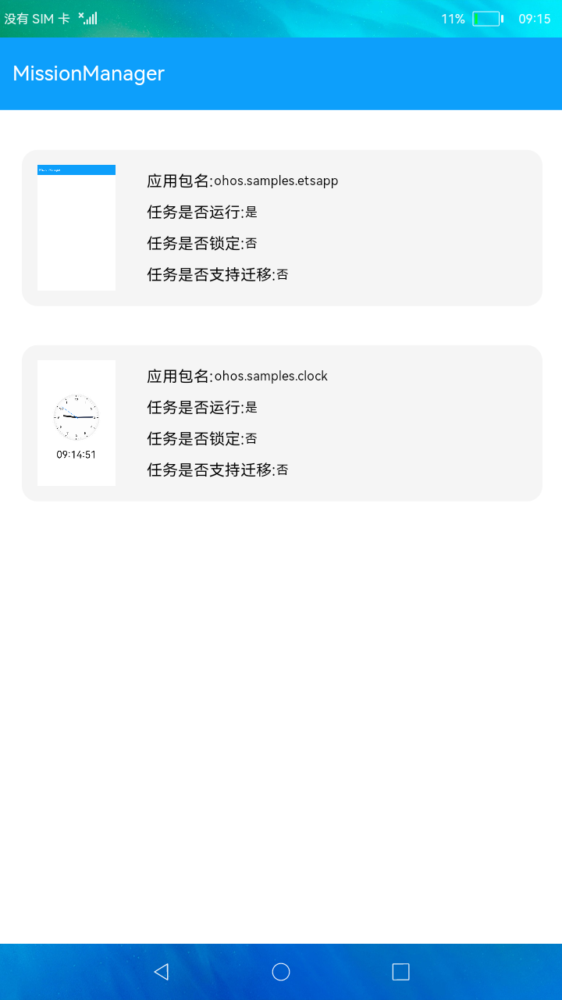

# 系统任务管理

### 简介

本示例通过调用系统任务管理的能力，对系统任务执行锁定、解锁、清理、切换到前台等操作。



### 相关概念

任务管理：对任务执行锁定、解锁、清理、切换到前台等操作。

### 相关权限

```
本示例需要在module.json5中配置如下权限:

任务管理权限：ohos.permission.MANAGE_MISSIONS
```

### 使用说明

1.下拉“**获取系统任务信息**”，获取当前系统任务的包名、运行状态、锁定状态、任务是否支持迁移、任务快照等信息列表，且最多可获取10条任务。

2.左滑任务列表，点击“**锁定**”，即可锁定指定的任务。

3.若当前任务已锁定，可点击“**解锁**”，即可解锁指定的任务。

4.点击“**删除**”，即可删除指定的任务。

5.点击“**移动**”，即可将指定的任务移动到前台执行。

### 约束与限制

1.本示例仅支持在标准系统上运行。

2.本示例为stage模型，从API version 9开始支持。

3.本示例需要使用DevEco Studio 3.0 Beta3 (Build Version: 3.0.0.901, built on May 30, 2022)才可编译运行。