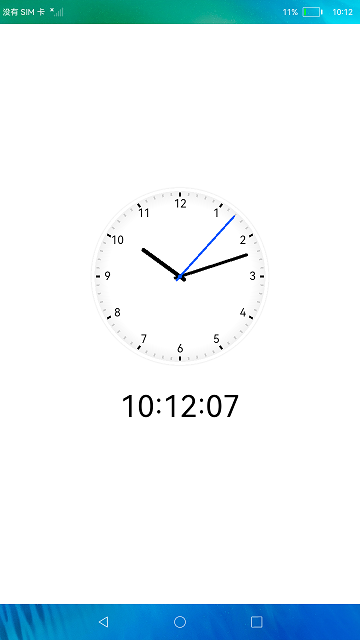

# 时钟

### 简介

本示例使用JS UI能力实现一个简单的时钟应用。实现效果如下：

### 相关概念

-  TextClock：TextClock组件通过文本将当前系统时间显示在设备上。支持不同时区的时间显示，最高精度到秒级。

### 相关权限

不涉及

### 使用说明

界面通过setInterval实现周期性实时刷新时间，transform：动画样式，可以设置平移/旋转/缩放的属性。时钟的指针使用rotate设置x轴和y轴两个维度参数，rotate可以传入具体角度值。指针旋转角度通过计算得出。

例如："transform : rotate\(\{\{ second \* 6 \}\}deg\)", 秒针1秒转动6度。

### 约束与限制

1.本示例仅支持在标准系统上运行。

2.本示例需要使用DevEco Studio 3.0 Beta3 (Build Version: 3.0.0.901, built on May 30, 2022)才可编译运行。