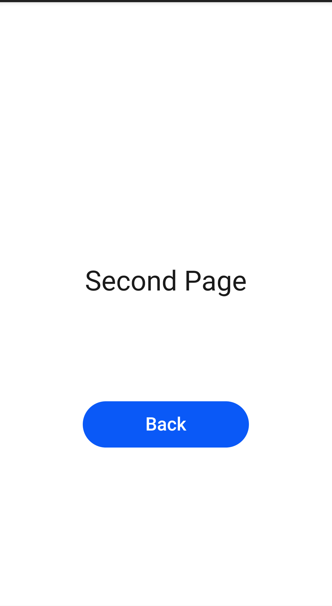

# 你好世界

### 简介

本示例适用于应用开发的初学者，为用户展示简单的JS UI界面显示和跳转。实现效果如下：

### 相关概念

-  页面路由：页面路由router根据页面的uri找到目标页面，从而实现跳转。

### 相关权限

不涉及

### 使用说明

本示例使用JS编写两个简单的页面，实现在第一个页面点击按钮跳转到第二个页面的功能。

### 约束与限制

1.本示例仅支持在标准系统上运行。

2.本示例需要使用DevEco Studio 3.0 Beta3 (Build Version: 3.0.0.901, built on May 30, 2022)才可编译运行。