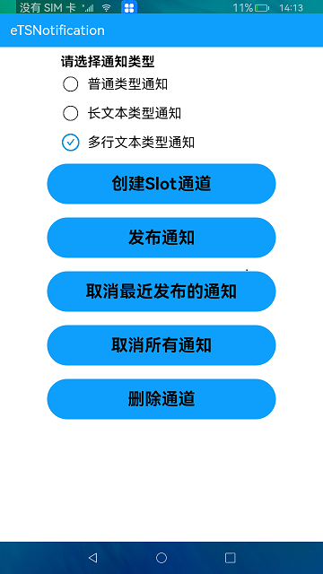

# 通知

### 简介

本示例展示了在eTS中如何创建和删除Slot通道，如何发布和取消通知。实现效果如下：

### 相关概念

-  发布通知：使用 Notification.publish接口发布通知。
- NotificationRequest：设置要发布通知内容的NotificationRequest对象。

### 相关权限

不涉及

### 使用说明

1.在界面中点击**创建Slot通道**，创建完成提示"Add slot succeed"。

2.选择要发布的通知类型，点击**发布通知**，在通知栏会看到发布的通知，下拉通知栏后可以看到通知内容。

3.在发布通知后，下拉通知栏，在通知消息中，点击通知或通知中的按钮，可以跳转到本应用界面。

4.在应用界面点击**取消最近发布的通知**，可以取消最新发布的一条通知。

5.点击**取消所有通知**，可以取消所有发布的通知。

### 约束与限制

1.本示例支持标准系统上运行。

2.本示例需要使用DevEco Studio 3.0 Beta3 (Build Version: 3.0.0.901, built on May 30, 2022)才可编译运行。