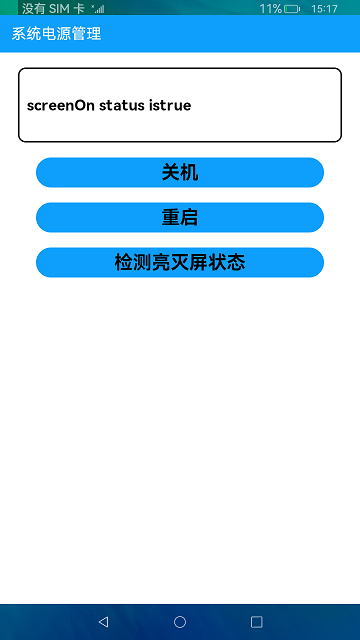

# 系统电源管理

### 简介

本示例展示了关机、重启以及检测亮灭屏状态的功能。实际效果如下：

#相关概念

该模块主要提供重启、关机、查询屏幕状态等接口。

### 相关权限

电源管理权限："ohos.permission.REBOOT"

### 使用说明

1.点击**关机**按钮，并在弹框中点击确定，系统将关机。点击取消，则关闭弹窗。

2.点击**重启**按钮，并在弹框中点击确定，系统将重启。点击取消，则关闭弹窗。

3.点击**检测亮灭屏状态**按钮，将会把检测的结果信息展示在显示窗口中。

### 约束与限制

1.本示例仅支持在标准系统上运行。

2.本示例需要使用DevEco Studio 3.0 Beta3 (Build Version: 3.0.0.901, built on May 30, 2022)才可编译运行。