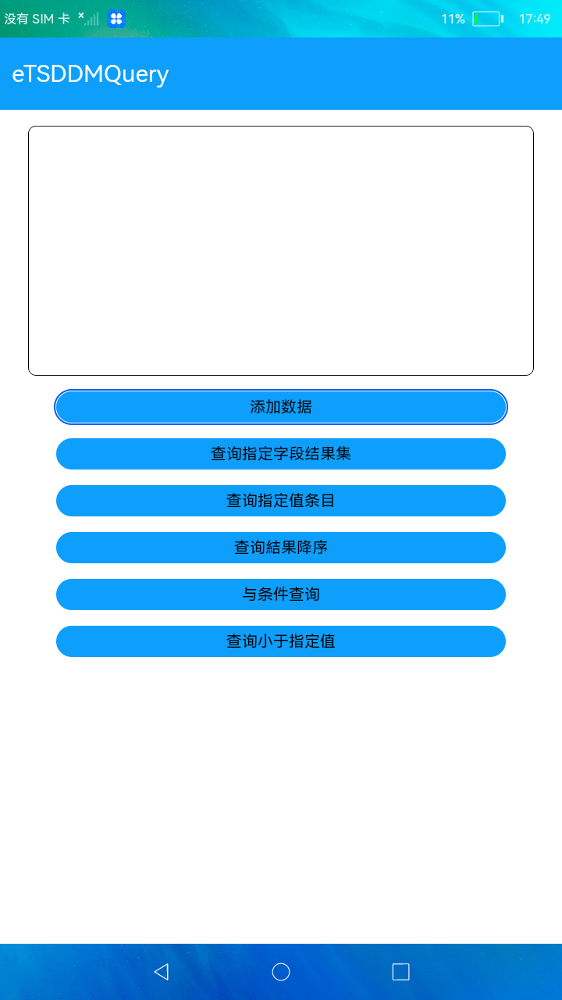

# 结果集与谓词

### 简介

本示例展示了分布式数据管理中，如何通过构建query对象， 查询kvstore中的数据，获取结果集。实现效果如下：



### 相关概念

-   KvStoreResultSet：提供获取KVStore数据库结果集的方法，提供查询和移动数据读取位置的方法，在调用KvStoreResultSet的方法前，需要先通过KVStore构建一个KVStore实例。

### 相关权限

```
本示例需要在module.json5中配置如下权限:

分布式数据管理权限：ohos.permission.DISTRIBUTED_DATASYNC
```

### 使用说明

### 使用说明

1.点击**添加数据**，将模板数据存入数据库。

2.点击**查询指定字段结果集**，从数据库中查询包含指定key字段的结果集。

3.点击**查询指定值条目**，通过谓词从数据库中查询包含指定key字段的结果集。

4.点击**与条件查询**，通过谓词从数据库中查询FieldNode对应的值不为特定值的结果集。

5.点击**查询結果降序**，通过谓词从数据库中查询FieldNode对应的值不为特定值且降序排序的结果集。

6.点击**查询小于指定值**，通过谓词从数据库中查询FieldNode对应的值小于特定值的键值对列表。

### 约束与限制

1.本示例仅支持在标准系统上运行。

2.本示例需要使用DevEco Studio 3.0 Beta3 (Build Version: 3.0.0.901, built on May 30, 2022)才可编译运行。