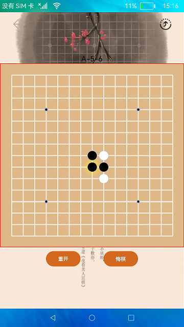

# 分布式五子棋

### 概要简介
五子棋是一款比较流行的棋类游戏，此游戏使用分布式数据管理功能进行开发完成的。实现效果如下：

### 相关概念

分布式五子棋：分布式数据管理实现五子棋双人对战

### 相关权限

数据同步权限：ohos.permission.DISTRIBUTED_DATASYNC

### 使用说明

1.启动应用，两个设备都确认权限后，并在同一个网络下，点击右上角图标，选择需要拉起的远程设备，点击后拉起远程设备，第一次拉起设备时，若未进行认证，属于认证码进行认证，认证成功后远程应用启动。

2.游戏过程中，本地设备的用户可以重开，悔棋，远程设备无此功能。下子时，在棋盘某位置点击第一次时预下子，若确定下在该位置，继续点击该位置，若不确定，点击其他位置即可。若远程设备因特殊原因退出或者掉线，本地设备可重新拉起远程设备，拉起后，本地设备点击棋盘任意位置，数据会同步到远程设备，继续进行未完成的游戏。

### 约束与限制

1.本示例仅支持标准系统上运行。

2.本示例为Stage模型，从API version 9开始支持。

3.本示例需要使用DevEco Studio 3.0 Beta3 (Build Version: 3.0.0.901, built on May 30, 2022)才可编译运行。