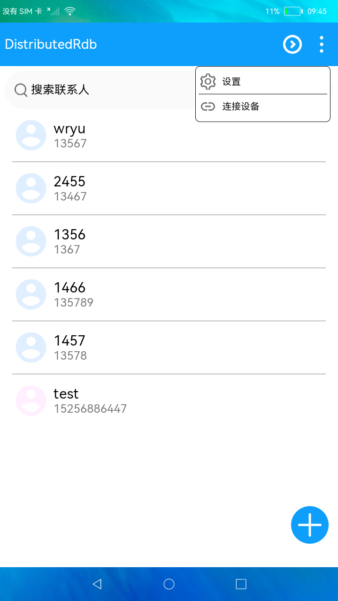

# 数据管理-分布式关系型数据库

### 简介

本示例展示了在eTS中分布式关系型数据库的使用，在增、删、改、查的基本操作外，还包括分布式数据库的数据同步同能。实现效果如下：



### 相关概念

-  关系型数据库：获得一个相关的RdbStore，操作关系型数据库，用户可以根据自己的需求配置RdbStore的参数，然后通过RdbStore调用相关接口可以执行相关的数据操作，包括增、删、改、查。
- 分布式关系型数据库：通过rdb的sync接口实现数据同步，通过 on('dataChange')方法实现监听数据变更从而读取对端设备上的数据。

### 相关权限

```
本示例需要在config.json中配置如下权限:

分布式数据管理权限：ohos.permission.DISTRIBUTED_DATASYNC
```

### 使用说明

1. 启动应用后点击“**+**”按钮可以添加联系人。

2. 点击联系人可以进入编辑界面编辑联系人信息。

3. 长按联系人进入多选状态，底部有“**全选**”、“**取消**”、“**删除**”、“**退出**”按钮，点击退出可以退出多选状态。

4. 点击右上角更多按钮，点击“**连接设备**”，选择要同步数据的设备，连接成功后可以开始将本端数据同步到对端。

5. 点击右上角更多按钮，点击“**设置**”可以进入设置界面设置数据同步方式，包括自动同步和手动同步。

### 约束与限制

1. 本示例的同步功能需要两台设备组网后测试。

2. 本示例仅支持标准系统上运行。

3. 本示例需要使用DevEco Studio 3.0 Beta3 (Build Version: 3.0.0.901, built on May 30, 2022)才可编译运行。