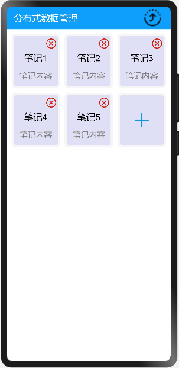

# 分布式数据管理

### 简介

本示例展示了在eTS中分布式数据管理的使用，包括KVManager对象实例的创建和KVStore数据流转的使用。实现效果如下：



### 相关概念

-  分布式数据管理：分布式数据管理为应用程序提供不同设备间数据库的分布式协同能力。通过调用分布式数据各个接口，应用程序可将数据保存到分布式数据库中，并可对分布式数据库中的数据进行增/删/改/查等各项操作。

### 相关权限

```
本示例需要在module.json5中配置如下权限:

分布式数据管理权限：ohos.permission.DISTRIBUTED_DATASYNC
```

### 使用说明

### 使用说明

1.两台设备组网

2.在一台界面中点击右上角的流转按钮，在弹窗中选择对端设备拉起对端设备上的应用。

3.拉起对端设备后，在界面中点击"+"按钮新增笔记卡片，点击每个卡片右上角的"X"按钮可以删除此卡片，可以看到对端设备和当前设备界面数据保持一致。

4.操作对端设备，当前设备界面也会保持和对端设备界面显示一致。


### 约束与限制

1.本示例仅支持标准系统上运行。

2.本示例需要使用3.0.0.901及以上的DevEco Studio版本才可编译运行。
