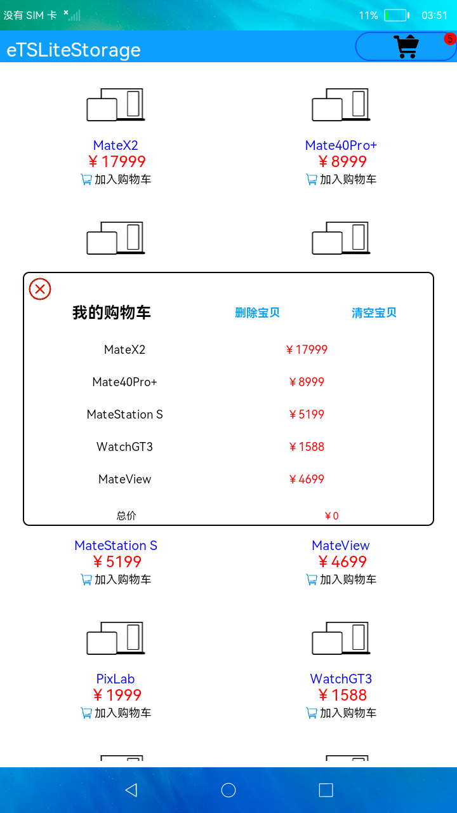

#  轻量级存储

### 简介

轻量级数据存储主要提供轻量级Key-Value操作，支持本地应用存储少量数据。本示例通过对购物车商品的添加和删除并保存退出的操作，使得再次打开应用时依然可以保留退出前的购物车信息，体现了轻量级存储在保存轻量级数据时的作用。实现效果如下：

### 相关概念

- 轻量级存储：轻量级存储为应用提供key-value键值型的文件数据处理能力，支持应用对数据进行轻量级存储及查询。数据存储形式为键值对，键的类型为字符串型，值的存储数据类型包括数字型、字符型、布尔型。

### 相关权限

不涉及

### 使用说明

1. 选择商品点击加入购物车，当购物车数量大于5时，右上方购物车图标为满状态，则购物车已满不能再添加商品。

2. 点击上方购物车图标，查看已添加的商品，并可对购物车内的商品进行删除或者清空购物车，商品总价与购物车图标也会相应的发生变化。

3. 退出应用再重新打开购物车时，将会展示购物车在退出前的商品信息。

### 约束与限制

1. 本示例仅支持在标准系统上运行。

2. 本示例需要使用DevEco Studio 3.0 Beta3 (Build Version: 3.0.0.901, built on May 30, 2022)才可编译运行。