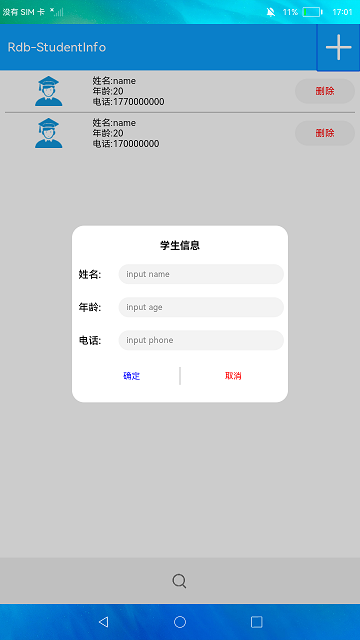

# 关系型数据库

### 简介

本示例展示了在eTS中关系型数据库的使用，包括增、删、改、查等操作。实现效果如下：

### 相关概念

- 关系型数据库：关系型数据库（Relational Database，RDB）是一种基于关系模型来管理数据的数据库。关系型数据库基于SQLite组件提供了一套完整的对本地数据库进行管理的机制，对外提供了一系列的增、删、改、查等接口，也可以直接运行用户输入的SQL语句来满足复杂的场景需要。。

### 相关权限

不涉及

### 使用说明

1.再首页点击右上角的加号，在弹窗中输入要插入的姓名、年龄、电话，点击确定可以插入一条学生信息。

2.在界面上的学生列表中，点击**Delete**按钮可以删除此条数据。

3.点击底部搜索按钮，进入搜索界面。

4.在搜索界面输入要搜索的姓名后点击**按姓名搜索**，搜索界面会显示在下方列表中。

5.点击**按年龄搜索**或**按电话搜索**，会按照提示的条件搜索，搜索结果显示在下方列表中。

### 约束与限制

1.本示例仅支持标准系统上运行。

2.本示例需要使用DevEco Studio 3.0 Beta3 (Build Version: 3.0.0.901, built on May 30, 2022)才可编译运行。
