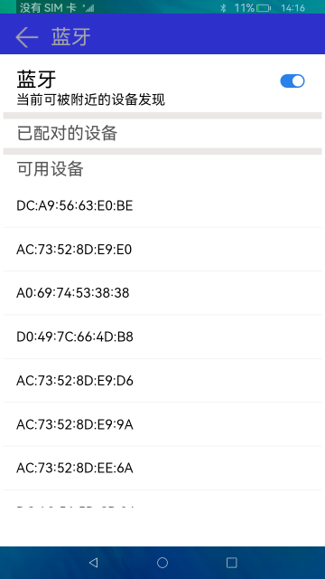

# 蓝牙

### 概要简介

蓝牙技术是一种无线数据和语音通信开放的全球规范，它是基于低成本的近距离无线连接，为固定和移动设备建立通信环境的一种特殊的近距离无线技术连接。，此示例实现蓝牙的设备发现，配对，取消配对功能，实现效果如下：

### 相关概念

蓝牙：蓝牙模块提供了基础的传统蓝牙能力。

### 相关权限

本示例需要在module.json5中配置如下权限:

蓝牙使用权限：ohos.permission.USE_BLUETOOTH

位置发现权限：ohos.permission.LOCATION

设备发现权限：ohos.permission.DISCOVER_BLUETOOTH

蓝牙管理权限：ohos.permission.MANAGE_BLUETOOTH

### 使用说明

1.启动应用，若蓝牙本来就打开的，系统会直接搜索周围可配对的设备，若蓝牙未打开，打开开关。

2.搜索到附近的设备后，选择需要配对的设备，点击该设备，会跳出匹配弹窗，若确定匹配，点击**匹配**按钮，否则点击**取消**按钮

3.匹配后，若想删除匹配的设备，点击已配对的设备列表中的设备，会跳出断开连接弹窗，若确定删除该设备，点击**确定**，否则点击**取消**

### 约束与限制

1.本示例仅支持标准系统上运行。

2.本示例为stage模型，从API version 9开始支持。

3.本示例需要使用3.0.0.901及以上的DevEco Studio版本才可编译运行。