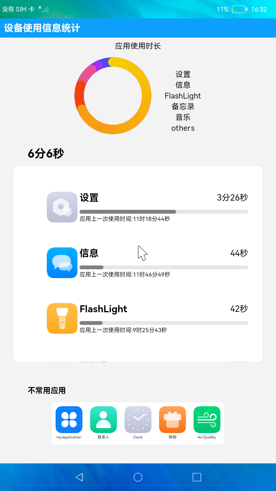

#  设备使用信息统计

### 简介

本示例主要展示了设备使用信息情况。实现效果如下：

# 相关概念

[通过指定起始和结束时间查询应用使用时长统计信息](https://gitee.com/openharmony/docs/blob/master/zh-cn/application-dev/reference/apis/js-apis-deviceUsageStatistics.md#bundlestatequerybundlestateinfos-1)
[判断指定bundleName的应用当前是否是空闲状态](https://gitee.com/openharmony/docs/blob/master/zh-cn/application-dev/reference/apis/js-apis-deviceUsageStatistics.md#bundlestateisidlestate-1)

### 相关权限

本示例需要在module.json5中配置如下权限:

应用信息权限：ohos.permission.BUNDLE_ACTIVE_INFO

### 使用说明

1. 顶部的数据面板展示了最常用的五个应用的使用时间占比情况。
2. 中部的竖向滑动栏展示了每个应用的使用总时长和最后一次使用的时间。
3. 底部的横向滑动栏展示了不常用应用列表。

### 约束与限制

1.本示例仅支持在标准系统上运行。

2.本示例需要使用3.0.0.901及以上的DevEco Studio版本才可编译运行。