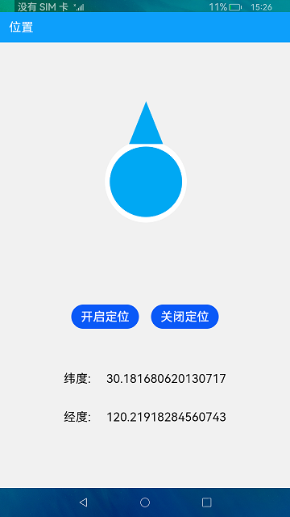

# 位置服务

### 简介

本示例使用方向传感器及GPS，实现获取当前位置信息。效果图如下：

### 相关概念

- [位置服务](https://gitee.com/openharmony/docs/blob/master/zh-cn/application-dev/reference/apis/js-apis-geolocation.md)：位置服务相关接口，包括获取位置信息，逆地理编码等。

### 相关权限

位置服务: ohos.permission.LOCATION

位置服务: ohos.permission.LOCATION_IN_BACKGROUND

传感器: ohos.permission.VIBRATE

### 使用说明

1.根据设备的方向传感器，界面图片转向。

2.点击**获取位置信息**按钮，开启位置定位服务，下方显示当前位置的经纬度。

3.点击**停止获取位置信息**按钮，关闭位置定位服务。

### 约束与限制

1.本示例仅支持在标准系统上运行。

2.本实例需在室外开阔环境下测试，获取位置信息需2-5分钟。

3.本示例需要使用DevEco Studio 3.0 Beta3 (Build Version: 3.0.0.901, built on May 30, 2022)才可编译运行。