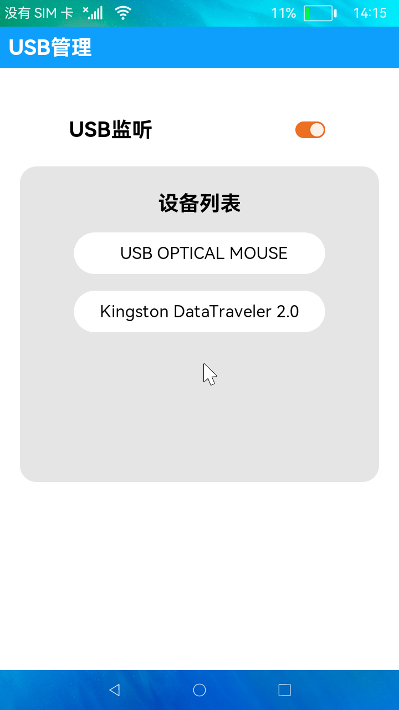

# USB管理

### 简介

本示例展示了USB设备管理的使用，包括USB设备插拔状态监听和USB设备信息显示。实现效果如下：

#相关概念

1.[订阅USB监听事件](https://gitee.com/openharmony/docs/blob/master/zh-cn/application-dev/reference/apis/js-apis-commonEvent.md#commoneventcreatesubscriber)：通过订阅USB插入和移除的监听事件，获取接口使用状态。

2.[获取USB设备列表](https://gitee.com/openharmony/docs/blob/master/zh-cn/application-dev/reference/apis/js-apis-usb.md#usbgetdevices)：获取已插入的USB设备列表。

### 相关权限

不涉及

### 使用说明

1.打开**USB监听**开关，界面弹出"开始监听..."的提示。

2.插入设备，界面会有“USB已插入”的提示,设备列表会显示已插入的设备。如果列表没有及时更新，则可以下拉列表手动刷新。

3.点击设备，弹框会显示该USB设备的具体信息，点击**确定**按钮返回主页面。

4.将USB设备拔出，界面会有“已移除设备”的提示，设备列表会移除该设备型号。如果列表没有及时更新，则可以下拉列表手动刷新。

### 约束与限制

1.本示例仅支持在标准系统上运行。

2.本示例需要使用3.0.0.901及以上的DevEco Studio版本才可编译运行。