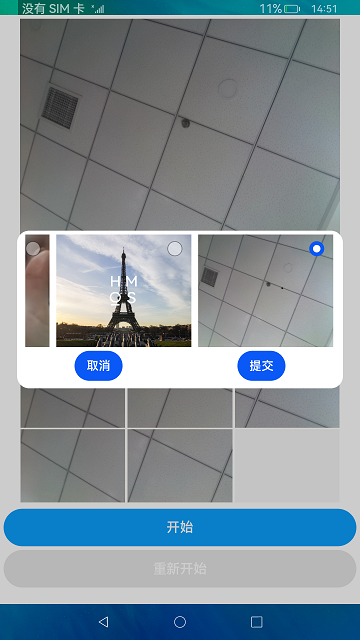

# 拼图

### 简介

拼图Demo是基于Grid组件进行开发，通过image (图片处理)和medialibrary (媒体库管理)接口实现获取图片，以及图片裁剪分割。实现效果如下：



### 相关概念

- ImagePacker：图片打包器类，用于图片压缩和打包。在调用ImagePacker的方法前，需要先通过createImagePacker构建一个ImagePacker实例。
- 媒体库管理：获取媒体库的实例，用于访问和修改用户等个人媒体数据信息（如音频、视频、图片、文档等）。

### 相关权限

```
本示例需要在module.json5中配置如下权限:

读取公共媒体文件权限：ohos.permission.READ_MEDIA
```

### 使用说明

1.使用预置相机拍照后启动应用，应用首页会读取设备内的图片文件并展示获取到的第一个图片，没有图片时图片位置显示空白。

2.点击Start开始后，时间开始倒计时，在规定时间内未完成拼图则游戏结束。在游戏中，玩家点击Restart进行游戏重置。

3.点击开始游戏后，玩家可以根据上方的大图，点击灰格周围的图片移动，点击后图片和灰格交换位置,最终拼成完整的图片。

4.不在游戏中时，玩家可以点击上方大图，选择自定义图片来进行拼图游戏。

### 约束与限制

1.本示例仅支持标准系统上运行。

2.本示例为Stage模型，从API version 9开始支持。

3.本示例需要使用DevEco Studio 3.0 Beta3 (Build Version: 3.0.0.901, built on May 30, 2022)才可编译运行。