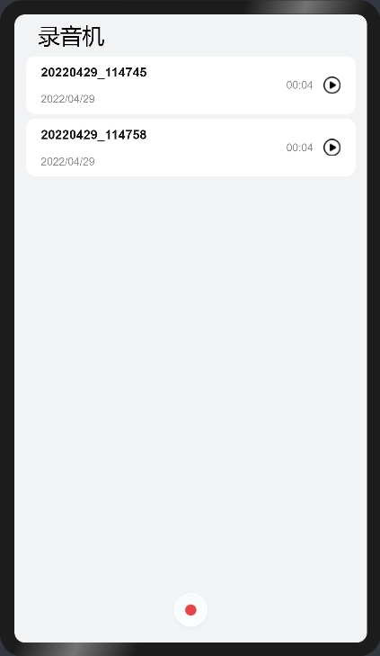

# JS录音机

### 简介

 此Sample通过调用媒体相关接口来实现音频录制和播放的功能。效果图如下：

### 相关概念

- [音频录制开发指导](https://gitee.com/openharmony/docs/blob/master/zh-cn/application-dev/media/audio-recorder.md)：音频录制的主要工作是捕获音频信号，完成音频编码并保存到文件中，帮助开发者轻松实现音频录制功能。它允许调用者指定音频录制的采样率、声道数、编码格式、封装格式、文件路径等参数。

### 相关权限

麦克风权限：ohos.permission.MICROPHONE

### 使用说明

1.启动应用，点击首页底部**录制**按钮跳转到录制界面开始录制音频，录制过程中可以点击右下角的**暂停**按钮暂停录制，点击红色的**停止**按钮停止录音并返回首页，首页中展示录制好的音频文件。

2.点击**音频文件**可以播放该文件，播放界面可以点击按钮进行暂停和继续播放。

3.长按音频文件可以滑出重命名和删除按钮，点击可以对该音频文件进行重命名和删除操作。

### 约束与限制

1.本示例仅支持标准系统上运行。

2.本示例需要使用DevEco Studio 3.0 Beta3 (Build Version: 3.0.0.901, built on May 30, 2022)才可编译运行。
