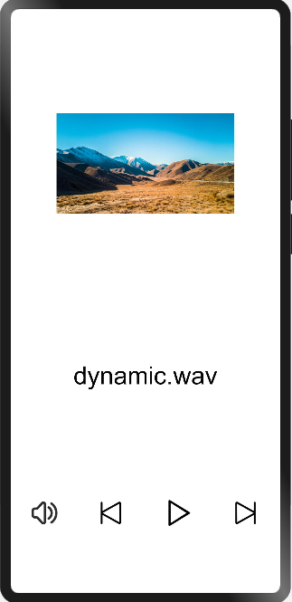

# 音频播放和管理

### 简介

本示例展示了JS音频播放的使用方法，以及音频的音量大小设置。实现效果如下：

### 相关概念

-  音频管理：音频管理提供管理音频的一些基础能力，包括对音频音量、音频设备的管理，以及对音频数据的采集和渲染等。

### 相关权限

不涉及

### 使用说明

1.分别点击界面**播放**、**上一个**、**下一个**、**暂停**按钮，实现相应的功能。

2.点击**音量键**，弹出音频管理界面，滑动音量条，设置音量大小；点击**close**，关闭音频管理界面。

### 约束与限制

1.本示例仅支持在标准系统上运行。

2.本示例需要使用DevEco Studio 3.0 Beta3 (Build Version: 3.0.0.901, built on May 30, 2022)才可编译运行。