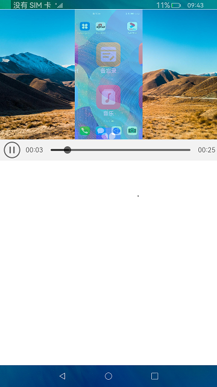

# 视频播放和管理

### 简介

 此Demo使用JS UI中的<video/>组件，实现视频播放。您可以通过video自带的控制栏进行播放、暂停等操作。实现效果如下：

### 相关概念

-  video：视频播放组件，通过在布局中使用video组件，设置播放视频内容的路径实现视频的播放。

### 相关权限

不涉及

### 使用说明

1.启动应用，界面展示<video/>组件，加载预置视频，此时视频处于暂停播放状态。

2.点击底部控制栏的播放按钮开始播放视频，点击视频会暂停或继续播放。

3.长按视频界面会退出播放状态，界面重新加载。

### 约束与限制

1.本示例仅支持标准系统上运行。

2.本示例需要使用DevEco Studio 3.0 Beta3 (Build Version: 3.0.0.901, built on May 30, 2022)才可编译运行。