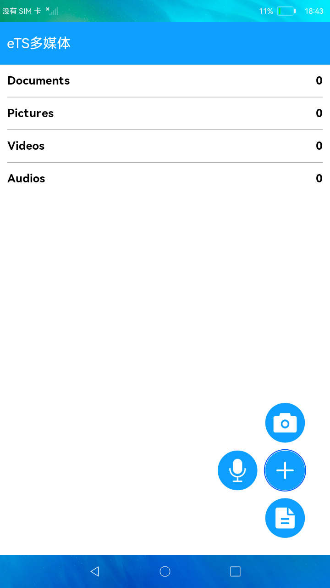

# 相机和媒体库

### 简介

 此Demo展示如何在eTS中调用相机拍照和录像，以及如何使用媒体库接口进行媒体文件的增、删、改、查操作。实现效果如下：



### 相关概念

-  媒体库管理：媒体库管理提供接口对公共媒体资源文件进行管理，包括文件的增、删、改、查等。
-  相机：相机模块支持相机相关基础功能的开发，主要包括预览、拍照、录像等。。

### 相关权限

```
本示例需要在module.json5中配置如下权限:

相机权限：ohos.permission.CAMERA
麦克风权限：ohos.permission.MICROPHONE
访问媒体文件地理位置信息权限：ohos.permission.MEDIA_LOCATION
读取公共媒体文件权限：ohos.permission.READ_MEDIA
读写公共媒体文件权限：ohos.permission.WRITE_MEDIA
```

### 使用说明

1.启动应用，在权限弹窗中授权后返回应用，首页显示当前设备的相册信息，首页监听相册变化会刷新相册列表。

2.点击 **+** 按钮，弹出相机、录音、文本文件三个图标。

3.点击**相机**图标，进入相机界面，默认是拍照模式，点击底部拍照按钮可以拍照，拍照完成会在底部左侧显示照片预览图。点击**录像**切换到录像模式，点击底部按钮开始录像，点击结束按钮结束录像，结束录像后底部左侧显示视频图标。点击系统**Back**键或界面顶部**返回**按钮返回首页。

4.点击**录音**图标进入录音界面，点击右侧**开始**按钮开始录音，按钮变为暂停按钮，点击可以暂停和继续录音，点击左侧**结束**按钮结束录音返回首页。

5.点击**文本**图标进入文本编辑界面，输入文本内容后点击**Save**按钮，会创建并写入文本文件，完成后返回首页。

6.点击相册进入文件列表界面，展示相册内的文件，列表中有**删除**和**重命名**按钮，点击可以删除文件和重命名文件。

7.安装视频播放demo后，点击视频文件可以调起视频博凡该界面播放视频。

### 约束与限制

1.rk3568底层录像功能有问题，暂不支持录像功能。

2.本示例仅支持标准系统上运行。

3.本示例为Stage模型，从API version 9开始支持。

4.本示例需要使用3.0.0.901及以上的DevEco Studio版本才可编译运行。
