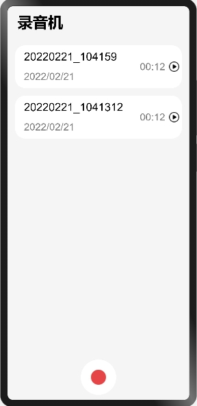
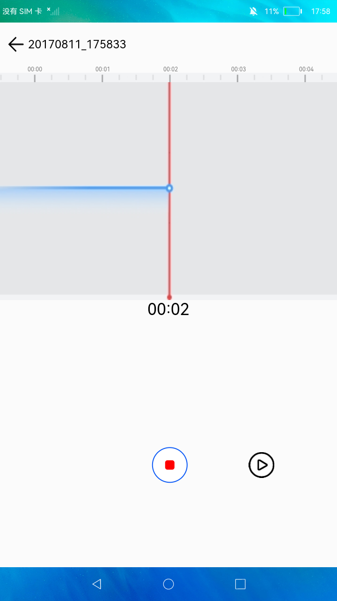

# 录音机

### 简介

 此Demo展示媒体服务中音频录制和播放功能的使用。实现效果如下：

 

### 相关概念

-  AudioRecorder：音频录制的主要工作是捕获音频信号，完成音频编码并保存到文件中，帮助开发者轻松实现音频录制功能。它允许调用者指定音频录制的采样率、声道数、编码格式、封装格式、文件路径等参数。
-  AudioPlayer：音频播放的主要工作是将音频数据转码为可听见的音频模拟信号并通过输出设备进行播放，同时对播放任务进行管理。

### 相关权限

```
本示例需要在config.json中配置如下权限:

麦克风权限：ohos.permission.MICROPHONE
```

### 使用说明

1.启动应用，点击首页底部**录制**按钮跳转到录制界面开始录制音频，录制过程中可以点击右下角的**暂停**按钮暂停录制，点击顶部**返回键**或红色的**停止**按钮停止录音并返回首页，首页中展示录制好的音频文件。

2.点击**音频文件**可以播放该文件，播放界面可以点击按钮进行暂停和继续播放。

3.长按音频文件进入多选状态，可以选择音频文件，选择后可以点击底部的按钮进行重命名和删除操作。

4.左滑音频文件，可以滑出重命名和删除按钮，点击可以对该音频文件进行重命名和删除操作。

### 约束与限制

1.本示例仅支持标准系统上运行。

2.本示例需要使用DevEco Studio 3.0 Beta3 (Build Version: 3.0.0.901, built on May 30, 2022)才可编译运行。
